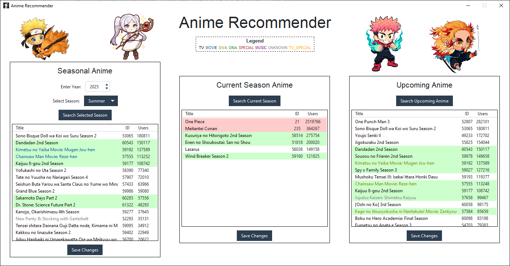

# AnimeFinder 🎬

**Never miss a must-watch anime again!**

Are you overwhelmed by the sheer number of anime released every season? Do you struggle to find the next must-watch anime? Look no further! **AnimeFinder** is here to help. This program utilizes the MyAnimeList API to provide anime recommendations based on sequels and popularity.

---

## ✨ Features

### 🔄 Sequel-Based Recommendations

_"If it's getting a sequel, it's probably good!"_

- Discover all sequel/prequel/related anime for any season
- Search for general upcoming sequel anime.

This feature helps you catch up on shows before their new seasons air, so you can watch them live!

### 🔥 Popularity-Based Recommendations

_"100,000 MAL users can't be wrong!"_

- Get recommendations filtered by popularity threshold (default: 100k+ users)
- See what's trending in the current season

---

## 🖥️ Preview



---

## Installation

1. Clone the repository

```bash
    git clone https://github.com/QuentinBot/AnimeFinder.git
    cd AnimeFinder
```

2. Install dependencies

```bash
    pip install -r requirements.txtr
```

3. Configure MAL API
   - Get your MyAnimeList API key [here](https://myanimelist.net/apiconfig)
   - Add it to `config.py`
   ```bash
       MAL_KEY = "your_api_key_here"
   ```
4. Launch!

```bash
    python gui.py
```
